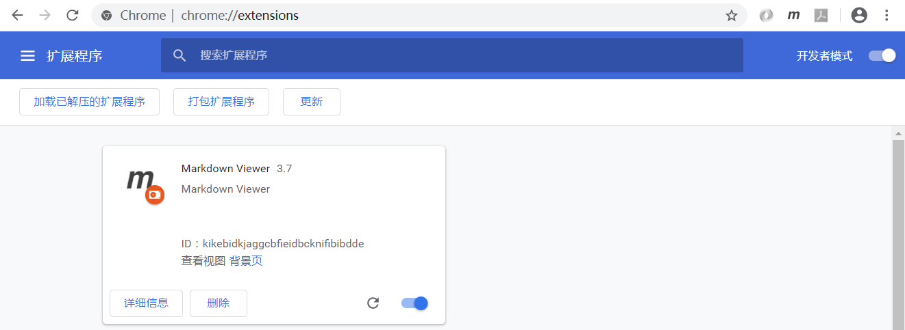
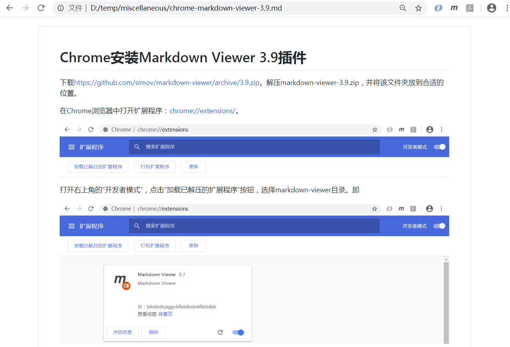

# Chrome安装Markdown Viewer 3.9插件

下载[https://github.com/simov/markdown-viewer/archive/3.9.zip](https://github.com/simov/markdown-viewer/archive/3.9.zip)。解压markdown-viewer-3.9.zip，并将该文件夹放到合适的位置。

在Chrome浏览器中打开扩展程序：[chrome://extensions/](chrome://extensions/)。

打开右上角的“开发者模式”，点击“加载已解压的扩展程序”按钮，选择markdown-viewer目录，即可安装Markdown Viewer插件。

然后将扩展名为*.md文件拖到Chrome浏览器中，即可浏览Markdown文档。

